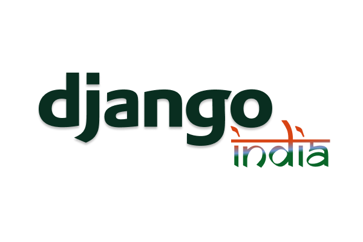

  

<h1 align="center">Welcome to Django India Community!</h1>

**Django India Community** is a vibrant and inclusive hub for Django developers, offering a supportive environment for learning, growth, and networking. Join us to connect with like-minded individuals, share knowledge, and collaborate on exciting projects. Whether you're a beginner or an experienced developer, our community welcomes everyone with open arms. Discover new opportunities, expand your professional network, and contribute to the growth of the Django ecosystem in India.

## Table of Contents
- [Code of Conduct](#code-of-conduct)
- [Get Involved and Make a Difference](#get-involved-and-make-a-difference)
- [Contributing to djangoindia website](#contributing-to-djangoindia-website)
- [Maintainers](#maintainers)
- [License](#license)

## Code of Conduct

We as members, contributors, and leaders pledge to make participation in our community a harassment-free experience for everyone, regardless of age, body size, visible or invisible disability, ethnicity, gender identity and expression, level of experience, education, socioeconomic status, nationality, personal appearance, race, religion, or sexual identity and orientation.

We pledge to act and interact in ways that contribute to an open, welcoming, diverse, inclusive, and healthy community.
For more details, please see our [Code of Conduct.](https://github.com/djangoindia/djangoindia.org/blob/main/CODE_OF_CONDUCT.md)

##  Get Involved and Make a Difference

Join our community. Here's how you can get involved:

- **Star the Repo:** Show your support by giving us a star! ⭐️
- **Spread the Word:** Share Django India with your colleagues and friends. 📣
- **Report Issues:** Notice something not quite right? Let us know by creating an issue. Your feedback is invaluable! 🐛
- **Contribute Code:** Dive into open issues and send pull requests to help us squash bugs and implement exciting enhancements. 🛠️
- **Review Pull requests:** By actively reviewing pull requests, you can help maintain the quality and integrity of the project, while also supporting other contributors and fostering a collaborative environment within the Django India community.🕵️
  
Together, let's build something incredible! ✨🚀

## Contributing to djangoindia website

We welcome contributions from everyone, whether you're fixing bugs, adding new features, or improving documentation. To contribute, please fork the repository, create a new branch for your changes, and submit a pull request. Make sure to follow our coding standards and include tests where applicable. We also encourage you to discuss significant changes by opening an issue before starting development. Your contributions help us build a stronger community—thank you for being a part of Django India!
For more details, please see our [Contributing.md](https://github.com/djangoindia/djangoindia.org/blob/main/contributing.md)

## Maintainers

<table>
  <tbody>
    <tr>
      <td align="center" width="150px">
        <a href="https://github.com/ankanchanda">
          
           
          Ankan Chanda
        </a>
         
        

          
          <!-- &nbsp;&nbsp;  <a href="mailto:bhuvnesh875@gmail.com">
             -->
          </a>
        

      </td>
      <td align="center" width="150px">
        <a href="https://github.com/nikhil25803">
          
           
          Nikhil Raj
        </a>
         
        

          
          <!-- &nbsp;&nbsp;  <a href="mailto:bhuvnesh875@gmail.com">
             -->
          </a>
        

      </td>
      <td align="center" width="150px">
        <a href="https://github.com/Knighthawk-Leo">
          
           
          Sanskar Dwivedi
        </a>
         
        

          
          <!-- &nbsp;&nbsp;   -->
        

      </td>
      <td align="center" width="150px">
        <a href="https://github.com/Saurabhsharma884">
          
           
          Saurabh Sharma
        </a>
         
        

          
          <!-- &nbsp;&nbsp;  <a href="mailto:bhuvnesh875@gmail.com">
             -->
          </a>
        

      </td>
    </tr>
  </tbody>
</table>

## License

This project is licensed under the MIT License, one of the most permissive and widely used open-source licenses.This means that you can integrate this project into your applications, modify it to fit your needs, and even distribute it as part of a commercial product without any concern for legal restrictions.
For more details, please see our [License.](https://github.com/djangoindia/djangoindia.org/blob/main/LICENSE)